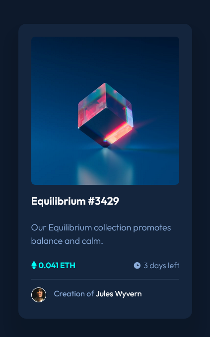

# Frontend Mentor - NFT preview card component solution

This is a solution to the [NFT preview card component challenge on Frontend Mentor](https://www.frontendmentor.io/challenges/nft-preview-card-component-SbdUL_w0U). Frontend Mentor challenges help you improve your coding skills by building realistic projects. 

## Table of contents

- [Frontend Mentor - NFT preview card component solution](#frontend-mentor---nft-preview-card-component-solution)
  - [Table of contents](#table-of-contents)
  - [Overview](#overview)
    - [The challenge](#the-challenge)
    - [Screenshot](#screenshot)
  - [My process](#my-process)
    - [Built with](#built-with)
    - [What I learned](#what-i-learned)


## Overview

### The challenge

Users should be able to:

- View the optimal layout depending on their device's screen size
- See hover states for interactive elements

### Screenshot




## My process

### Built with

- Semantic HTML5 markup
- CSS custom properties
- Flexbox
- CSS Grid
- Mobile-first workflow


### What I learned

1. How to create a color overlay on hover 


```html
    <div class="card__image-container">
      
      <div class="card__image__overlay">
        
      </div>
    </div>
```

```css
.card__image__overlay{
  display:flex;
  justify-content: center;
  align-items: center;

  position: absolute;
  top:0;
  left:0;
  width: 100%;
  height: 100%;
  background-color: var(--clr-secondary-400-low);
  opacity: 0%;

}

.card__image__overlay:hover{
  opacity: 100%;
  cursor:pointer;
}
```

2. The ::before pseudo-element does not work well with flexbox space-between